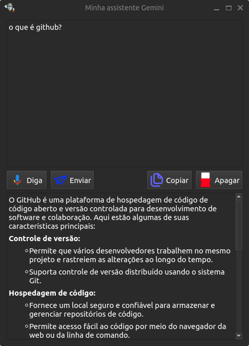

# ASSISTENTE COM INTELIGENCIA ARTIFICIAL GEMINI



### Passo a passo para utilização da assistente

- Baixe o repositório com o comando:

```
git clone https://github.com/elizeubarbosaabreu/assistente_virtual_em_python_com_gemini_ai.git
cd assistente_virtual_em_python_com_gemini_ai
```

- Crie um ambiente virtual e instale as dependências:

```
python3 -m venv env
source env/bin/activate
pip install --upgrade setuptools wheel
pip install -r requirements.txt
```

- Acesse o link [https://ai.google.dev/](https://ai.google.dev/) para cadastrar sua api-key. Copie e cole no local especificado no arquivo api_gemini.py
- Para executar o software basta executar o comando:

```
python3 app.py
```

- Se apresentar erros de dependênias pesquise e instale os adicionais. Testei tudo no Ubuntu 22.04
- Dá para converter o **app.py** em executável com o comando:

```
pyinstaller app.py
```

### Personalize o app à vontade

Deixei o arquivo template.ui para que você possa usar o QT Designer e modificar a interface do software para a maneira que preferir...

#### Obrigado por usar nossas criações

Não esqueça de deixar uma estrela e sugerir melhorias. Ainda tenho muito a aprender...
